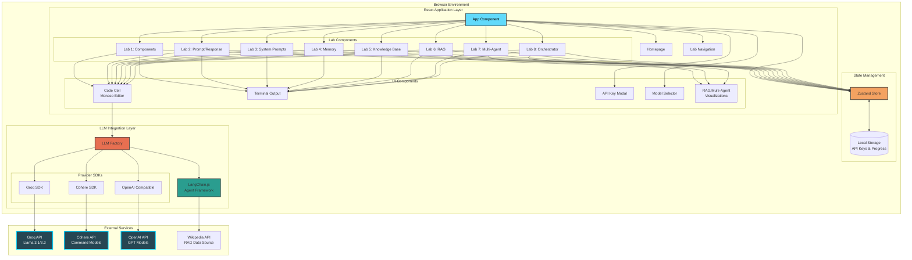
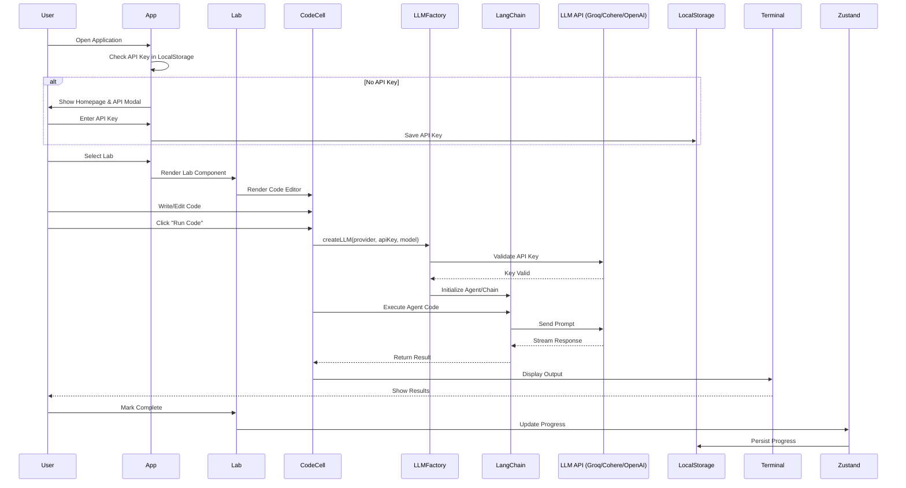
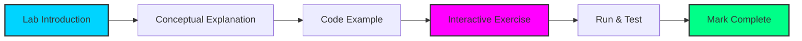
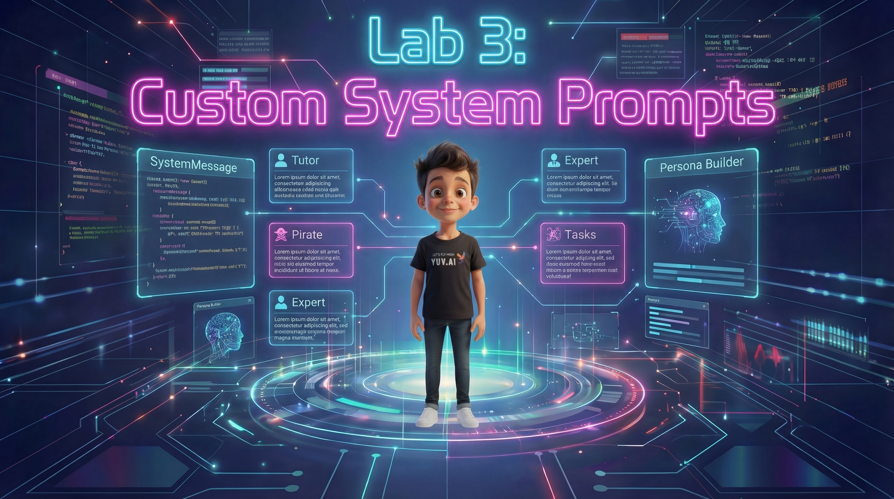
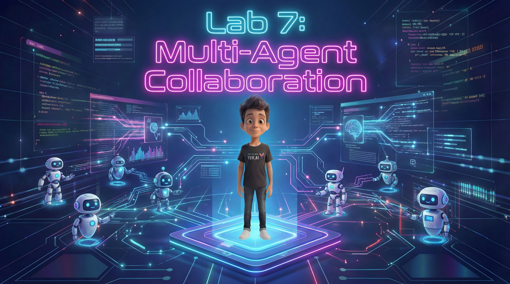
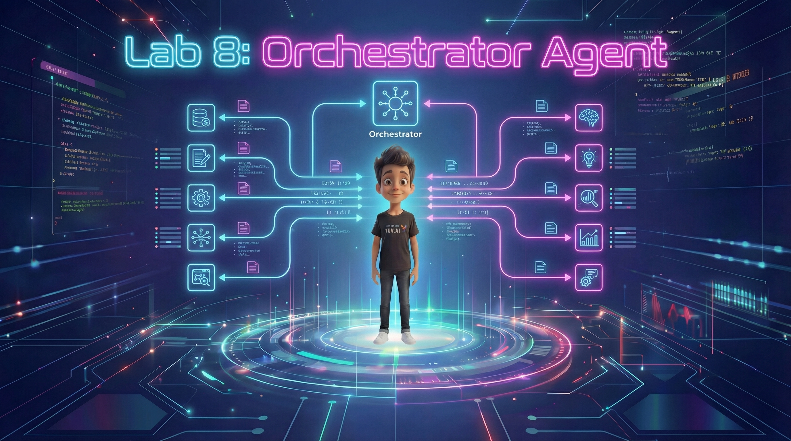
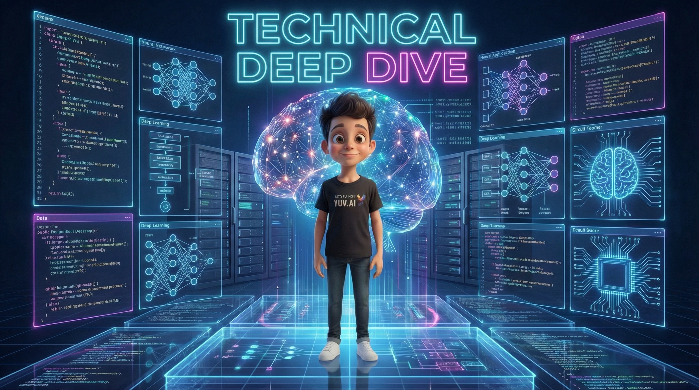
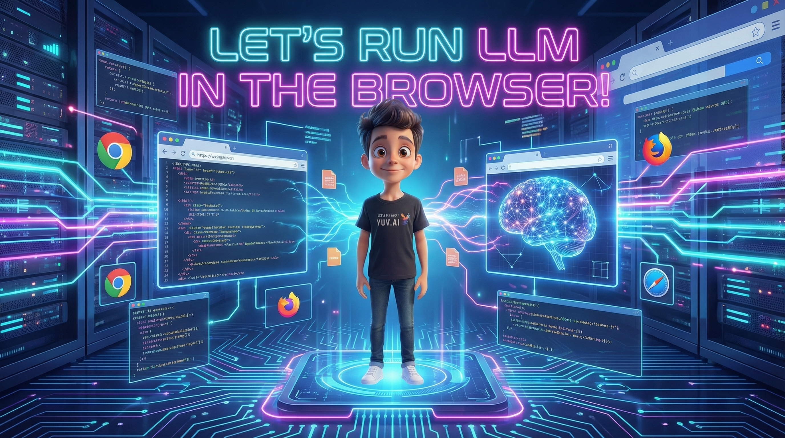
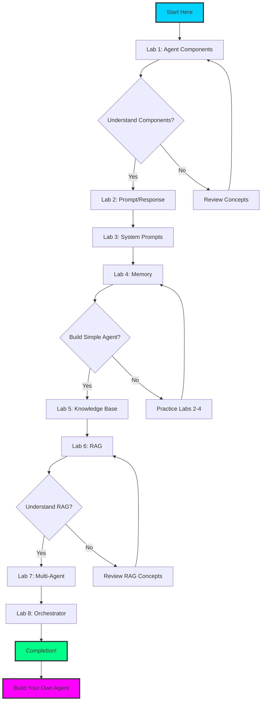

# AI Agents 101 - Interactive Training Platform

<div align="center">


**Master the art of building AI agents through 8 progressive, interactive labs**

[](https://react.dev/)
[](https://www.typescriptlang.org/)
[](https://vite.dev/)
[](https://js.langchain.com/)
[](https://tailwindcss.com/)

Created by [Yuval Avidani](https://yuv.ai) (@hoodini) - AI Builder, Speaker & Educator

</div>

---

## 📚 Table of Contents

- [Overview](#overview)
- [Architecture Diagram](#architecture-diagram)
- [Key Features](#key-features)
- [Real-World Use Cases](#real-world-use-cases)
- [Lab Structure](#lab-structure)
- [Technology Stack](#technology-stack)
- [Prerequisites](#prerequisites)
- [Installation](#installation)
- [Configuration](#configuration)
- [Running the Application](#running-the-application)
- [Deployment](#deployment)
- [Project Structure](#project-structure)
- [Learning Path](#learning-path)
- [Troubleshooting](#troubleshooting)
- [Contributing](#contributing)
- [License](#license)
- [About the Creator](#about-the-creator)

---

## 🎯 Overview

**AI Agents 101** is a comprehensive, browser-based interactive training platform designed to teach developers how to build production-ready AI agents from the ground up. Through 8 progressively complex labs, you'll learn everything from basic LLM interactions to orchestrating multi-agent systems.

### What Makes This Unique?

- **100% Browser-Based**: No backend required - everything runs in your browser using WebAssembly and client-side APIs
- **Real LLM Integration**: Work with actual LLM providers (Groq, Cohere, OpenAI) using your own API keys
- **Interactive Code Cells**: Monaco Editor integration for hands-on coding experience
- **Progressive Learning**: Each lab builds on previous concepts with increasing complexity
- **Visual Learning**: Interactive diagrams and visualizations for complex concepts like RAG and multi-agent systems
- **Progress Tracking**: Your progress is saved locally, pick up where you left off

---

## 🏗️ Architecture Diagram



### Component Flow Diagram



---

## ✨ Key Features

### 🎓 **8 Progressive Labs**
From basic concepts to advanced multi-agent orchestration:
1. **Agent Components** - Understanding LLM, Tools, and Memory
2. **Simple Prompt/Response** - Basic LLM interactions
3. **Custom System Prompts** - Crafting specialized agent behaviors
4. **Conversation Memory** - Building context-aware agents
5. **Knowledge Base** - Integrating structured data
6. **RAG with Wikipedia** - Retrieval-Augmented Generation with embeddings
7. **Multi-Agent Collaboration** - Coordinating multiple specialized agents
8. **Orchestrator Agent** - Advanced routing and task delegation

### 💻 **Interactive Code Environment**
- **Monaco Editor** - The same editor that powers VS Code
- **Syntax Highlighting** - Full TypeScript/JavaScript support
- **Auto-completion** - Intelligent code suggestions
- **Error Handling** - Real-time error feedback
- **Execution Output** - Terminal-style output display

### 🔌 **Multi-Provider LLM Support**
- **Groq** - Blazing-fast inference (Llama 3.1 70B, Llama 3.3 70B)
- **Cohere** - Command models optimized for agents
- **OpenAI** - GPT-3.5/GPT-4 compatibility

### 🎨 **Modern UI/UX**
- Futuristic cyberpunk-inspired design with light/dark theme toggle
- Smooth animations and transitions
- **100% Mobile Responsive** - Optimized for all screen sizes with collapsible navbar and sidebar
- Custom hero images for each lab with responsive scaling
- Progress tracking with visual indicators
- Clickable hexagonal module grid for quick lab access
- Multilingual support (English & Hebrew with RTL support)
- Fixed-position navbar controls for consistent UX
- Glass-morphism effects with Apple-style blur

### 🔐 **Privacy-First**
- API keys stored only in browser's localStorage
- No backend servers - all processing client-side
- No data collection or tracking
- Full control over your credentials

---

## 🌍 Real-World Use Cases

### 1. **Customer Support Automation**
**Scenario**: Build an intelligent customer service agent that handles inquiries, searches knowledge bases, and escalates complex issues.

**Labs Applied**:
- Lab 2: Basic response generation
- Lab 4: Remember customer conversation history
- Lab 5: Access product documentation knowledge base
- Lab 8: Route complex queries to specialized agents

**Example Output**:
```typescript
// Customer Support Agent
const supportAgent = new Agent({
  llm: groqLLM,
  memory: conversationMemory,
  tools: [searchKnowledgeBase, createTicket, checkOrderStatus],
  systemPrompt: "You are a helpful customer support agent..."
});

await supportAgent.chat("My order #12345 hasn't arrived");
// Agent: checks order status, provides tracking, offers solutions
```

### 2. **Research Assistant**
**Scenario**: Create an AI research assistant that can search Wikipedia, synthesize information, and generate comprehensive reports.

**Labs Applied**:
- Lab 3: System prompts for research focus
- Lab 6: RAG to retrieve and synthesize Wikipedia content
- Lab 7: Multiple specialized agents (researcher, writer, fact-checker)

**Example Output**:
```typescript
// Research Agent with RAG
const researchAgent = await createRAGAgent({
  llm: cohereLLM,
  topic: "quantum computing",
  sources: ["wikipedia", "arxiv"],
  outputFormat: "detailed-report"
});

const report = await researchAgent.research(
  "Explain quantum entanglement and its applications"
);
// Returns: Comprehensive report with citations
```

### 3. **Content Creation Pipeline**
**Scenario**: Multi-agent system for content creation with specialized agents for ideation, writing, editing, and SEO optimization.

**Labs Applied**:
- Lab 7: Multi-agent collaboration
- Lab 8: Orchestrator to coordinate workflow

**Example Output**:
```typescript
// Content Pipeline with Orchestrator
const contentPipeline = new OrchestratorAgent({
  agents: {
    ideator: new IdeaAgent(),
    writer: new WriterAgent(),
    editor: new EditorAgent(),
    seoOptimizer: new SEOAgent()
  }
});

await contentPipeline.execute({
  task: "Create blog post about AI trends 2025",
  workflow: "ideate → write → edit → optimize"
});
// Output: SEO-optimized, edited blog post
```

### 4. **Code Review Assistant**
**Scenario**: Automated code review system that analyzes code quality, suggests improvements, and checks best practices.

**Labs Applied**:
- Lab 2: Prompt engineering for code analysis
- Lab 5: Knowledge base of coding standards
- Lab 7: Multiple reviewers (security, performance, style)

**Example Output**:
```typescript
// Code Review Multi-Agent
const codeReviewTeam = {
  securityReviewer: createAgent("security expert"),
  performanceReviewer: createAgent("performance specialist"),
  styleReviewer: createAgent("code style enforcer")
};

const reviews = await Promise.all(
  Object.values(codeReviewTeam).map(agent =>
    agent.review(codeSubmission)
  )
);
// Returns: Comprehensive review from multiple perspectives
```

### 5. **Personal Learning Tutor**
**Scenario**: Adaptive learning system that remembers student progress, adjusts difficulty, and provides personalized explanations.

**Labs Applied**:
- Lab 4: Memory to track learning progress
- Lab 3: Adaptive system prompts based on skill level
- Lab 5: Curriculum knowledge base

**Example Output**:
```typescript
// Adaptive Tutor
const tutor = new AdaptiveTutor({
  llm: openaiLLM,
  memory: studentProgressMemory,
  curriculum: mathKnowledgeBase,
  adaptiveLevel: true
});

await tutor.teach("algebra", studentId);
// Adjusts explanations based on student's past performance
```

---

## 📖 Lab Structure

Each lab follows a consistent structure:



### Lab Progression

Each lab features a unique custom-designed hero image to visually represent the concepts covered:

<div align="center">

| Lab | Hero Image | Complexity | Concepts | Time |
|-----|------------|-----------|----------|------|
| **Lab 1** |  | ⭐ Beginner | LLM, Tools, Memory | 15 min |
| **Lab 2** |  | ⭐ Beginner | Basic Chat, Prompts | 20 min |
| **Lab 3** |  | ⭐⭐ Intermediate | System Prompts, Roles | 25 min |
| **Lab 4** |  | ⭐⭐ Intermediate | Conversation History | 30 min |
| **Lab 5** |  | ⭐⭐ Intermediate | Knowledge Bases | 30 min |
| **Lab 6** |  | ⭐⭐⭐ Advanced | RAG, Embeddings, Vector Search | 45 min |
| **Lab 7** |  | ⭐⭐⭐ Advanced | Multi-Agent Systems | 40 min |
| **Lab 8** |  | ⭐⭐⭐⭐ Expert | Orchestration, Routing | 50 min |

</div>

### 🔧 Technical Deep Dive

<div align="center">



</div>

Understanding how browser-based AI execution works with WebAssembly (Pyodide) and WebGPU (WebLLM). Learn the technical foundations that make running LLMs and Python code entirely in your browser possible.

### 🚀 Browser-Based AI Playground

<div align="center">



</div>

Run LLMs (Phi-3.5, Llama 3.2, Qwen 2.5) and Python code entirely in your browser using WebLLM and Pyodide. No server required - everything runs locally on your machine with GPU acceleration via WebGPU.

---

## 🛠️ Technology Stack

### Frontend Framework
- **React 19.2** - Latest React with concurrent features
- **TypeScript 5.9** - Type-safe development
- **Vite 7.2** - Lightning-fast build tool

### UI & Styling
- **Tailwind CSS 3.4** - Utility-first CSS framework
- **Lucide React** - Modern icon library
- **Custom CSS** - Cyberpunk-themed animations and effects

### State Management
- **Zustand 5.0** - Lightweight state management
- **LocalStorage API** - Persistent storage

### Code Editor
- **Monaco Editor 4.7** - VS Code's editor in the browser

### AI/ML Libraries
- **LangChain.js 1.2** - Agent framework and orchestration
- **@langchain/groq 1.0** - Groq provider integration
- **@langchain/cohere 1.0** - Cohere provider integration
- **@langchain/community 1.1** - Community tools and utilities
- **groq-sdk 0.37** - Native Groq SDK
- **cohere-ai 7.20** - Native Cohere SDK

### Development Tools
- **ESLint 9.39** - Code linting
- **TypeScript ESLint 8.46** - TypeScript-specific linting
- **PostCSS 8.5** - CSS processing
- **Autoprefixer 10.4** - CSS vendor prefixing

---

## 📋 Prerequisites

Before you begin, ensure you have the following:

### Required
- **Node.js** (v18.0.0 or higher)
- **npm** (v9.0.0 or higher) or **yarn** (v1.22.0 or higher)
- **Git** (for cloning the repository)

### API Keys (at least one)
You'll need an API key from one of these providers:

- **Groq** (Recommended for beginners)
  - Free tier available
  - Fast inference
  - Sign up: [https://console.groq.com](https://console.groq.com)

- **Cohere**
  - Free tier available
  - Optimized for agents
  - Sign up: [https://dashboard.cohere.ai](https://dashboard.cohere.ai)

- **OpenAI**
  - Paid service (pay-as-you-go)
  - GPT-3.5 Turbo / GPT-4
  - Sign up: [https://platform.openai.com](https://platform.openai.com)

### Recommended
- **VS Code** or similar code editor
- **Modern browser** (Chrome, Firefox, Edge, Safari - latest version)
- **Basic knowledge** of JavaScript/TypeScript
- **Understanding** of async/await and promises

---

## 🚀 Installation

### Step 1: Clone the Repository

```bash
git clone https://github.com/hoodini/ai-agents-101.git
cd ai-agents-101
```

### Step 2: Navigate to Application Directory

```bash
cd agents-training-app
```

### Step 3: Install Dependencies

Using npm:
```bash
npm install
```

Using yarn:
```bash
yarn install
```

This will install all required dependencies including:
- React and React DOM
- TypeScript
- Vite
- Tailwind CSS
- LangChain and provider SDKs
- Monaco Editor
- All development tools

### Step 4: Verify Installation

Check that all dependencies were installed correctly:

```bash
npm list --depth=0
```

You should see all packages listed in [package.json](agents-training-app/package.json).

---

## ⚙️ Configuration

### Environment Setup (Optional)

While the app works without environment variables (API keys are entered via UI), you can optionally create a `.env.local` file:

```bash
# .env.local (optional - for development convenience)
VITE_DEFAULT_PROVIDER=groq
VITE_GROQ_API_KEY=your_groq_api_key_here
VITE_COHERE_API_KEY=your_cohere_api_key_here
VITE_OPENAI_API_KEY=your_openai_api_key_here
```

**Important**: The `.env.local` file is gitignored and should never be committed to version control.

### Tailwind Configuration

Tailwind is pre-configured with custom colors and animations. Configuration file: [tailwind.config.js](agents-training-app/tailwind.config.js)

Custom theme includes:
- Cyberpunk color palette
- Neon glow effects
- Custom animations (particles, pulses, slides)
- Responsive breakpoints

### Vite Configuration

The Vite config is minimal and optimized for React: [vite.config.ts](agents-training-app/vite.config.ts)

---

## 🏃 Running the Application

### Development Mode

Start the development server with hot module replacement:

```bash
npm run dev
```

The application will be available at:
```
http://localhost:5173
```

Features in dev mode:
- Hot Module Replacement (HMR)
- Fast refresh
- Source maps for debugging
- Error overlay

### Production Build

Build the optimized production bundle:

```bash
npm run build
```

This creates an optimized build in the `dist/` directory with:
- Minified JavaScript and CSS
- Tree-shaking for smaller bundle size
- Asset optimization
- Source maps (optional)

### Preview Production Build

Preview the production build locally:

```bash
npm run preview
```

### Running Linter

Check code quality and style:

```bash
npm run lint
```

Fix auto-fixable issues:

```bash
npm run lint -- --fix
```

---

## 🌐 Deployment

### Deploy to Vercel (Recommended)

Vercel offers the easiest deployment for Vite apps:

1. **Install Vercel CLI**:
   ```bash
   npm install -g vercel
   ```

2. **Deploy**:
   ```bash
   cd agents-training-app
   vercel
   ```

3. **Follow prompts**:
   - Link to existing project or create new
   - Set build command: `npm run build`
   - Set output directory: `dist`

4. **Production deployment**:
   ```bash
   vercel --prod
   ```

### Deploy to Netlify

1. **Install Netlify CLI**:
   ```bash
   npm install -g netlify-cli
   ```

2. **Build the app**:
   ```bash
   npm run build
   ```

3. **Deploy**:
   ```bash
   netlify deploy --prod --dir=dist
   ```

### Deploy to GitHub Pages

#### Option 1: Using GitHub Pages Subdirectory (username.github.io/repo-name)

1. **Install gh-pages**:
   ```bash
   npm install --save-dev gh-pages
   ```

2. **Add to package.json**:
   ```json
   {
     "scripts": {
       "predeploy": "npm run build",
       "deploy": "gh-pages -d dist"
     }
   }
   ```

3. **Update vite.config.ts** for base path:
   ```typescript
   export default defineConfig({
     base: '/your-repo-name/',  // Replace with your repository name
     plugins: [react()],
   })
   ```

4. **Deploy**:
   ```bash
   npm run deploy
   ```

   Your site will be available at: `https://username.github.io/your-repo-name/`

#### Option 2: Using Custom Domain (recommended)

If you want to use a custom domain like `agents.yourdomain.com`:

1. **Install gh-pages** (if not already installed):
   ```bash
   npm install --save-dev gh-pages
   ```

2. **Update vite.config.ts** for root path:
   ```typescript
   export default defineConfig({
     base: '/',  // Root path for custom domain
     plugins: [react()],
   })
   ```

3. **Create CNAME file** in `public/` directory:
   ```bash
   echo "agents.yourdomain.com" > public/CNAME
   ```

   **Important**: Replace `agents.yourdomain.com` with your actual domain

4. **Add deploy scripts to package.json**:
   ```json
   {
     "scripts": {
       "predeploy": "npm run build",
       "deploy": "gh-pages -d dist"
     }
   }
   ```

5. **Deploy**:
   ```bash
   npm run deploy
   ```

6. **Configure DNS** (Cloudflare, Route53, etc.):

   Add a CNAME record:
   ```
   Type:    CNAME
   Name:    agents  (or your chosen subdomain)
   Target:  username.github.io  (your GitHub username)
   TTL:     Auto or 300
   ```

7. **Wait for SSL Certificate** (automatic):
   - GitHub Pages will automatically provision an SSL certificate via Let's Encrypt
   - This takes 10-60 minutes after DNS propagation
   - Check status at: `https://github.com/username/repo-name/settings/pages`

8. **Verify Deployment**:
   ```bash
   # Check GitHub Pages status
   gh api repos/username/repo-name/pages
   ```

   Your site will be available at: `https://agents.yourdomain.com/`

**Troubleshooting Custom Domain**:
- **SSL Certificate Error**: Wait for GitHub to provision the certificate (can take up to 1 hour)
- **404 Error**: Verify the CNAME file exists in the deployed `gh-pages` branch
- **Images Not Loading**: Use relative paths (`logo.png`) instead of absolute paths (`/logo.png`)
- **DNS Not Resolving**: Use `nslookup agents.yourdomain.com` to verify DNS propagation

### Deploy to AWS S3 + CloudFront

1. **Build the app**:
   ```bash
   npm run build
   ```

2. **Upload to S3**:
   ```bash
   aws s3 sync dist/ s3://your-bucket-name --delete
   ```

3. **Invalidate CloudFront cache**:
   ```bash
   aws cloudfront create-invalidation --distribution-id YOUR_DIST_ID --paths "/*"
   ```

### Environment Variables for Deployment

If using environment variables, set them in your deployment platform:

**Vercel**:
```bash
vercel env add VITE_GROQ_API_KEY
```

**Netlify**:
- Go to Site Settings → Build & Deploy → Environment
- Add variables: `VITE_GROQ_API_KEY`, etc.

**Note**: Since API keys are entered via UI, environment variables are optional.

---

## 📁 Project Structure

```
agents-training-app/
├── public/                          # Static assets
│   ├── hero.jpg                    # Homepage hero image
│   ├── logo.png                    # YUV.AI logo
│   ├── yuvai.png                   # Creator avatar
│   └── vite.svg                    # Vite icon
│
├── src/
│   ├── components/                 # React components
│   │   ├── ApiKeyModal.tsx        # API key configuration modal
│   │   ├── CodeCell.tsx           # Interactive code editor
│   │   ├── Homepage.tsx           # Landing page with clickable labs
│   │   ├── LabNavigation.tsx      # Lab sidebar navigation
│   │   ├── LanguageToggle.tsx     # Language switcher (EN/HE)
│   │   ├── ModelSelector.tsx      # LLM provider selector
│   │   ├── TerminalCodeCell.tsx   # Terminal output display
│   │   ├── ThemeToggle.tsx        # Dark/Light theme switcher
│   │   └── visualizations/        # Lab visualizations
│   │       ├── rag/               # RAG workflow diagrams
│   │       │   ├── ChunkingVisualization.tsx
│   │       │   ├── EmbeddingsVisualization.tsx
│   │       │   └── RAGWorkflowDiagram.tsx
│   │       └── multi-agent/       # Multi-agent diagrams
│   │           └── MultiAgentCollaborationFlow.tsx
│   │
│   ├── labs/                       # Lab components
│   │   ├── index.ts               # Lab exports
│   │   ├── Lab1.tsx               # Agent Components
│   │   ├── Lab2.tsx               # Simple Prompt/Response
│   │   ├── Lab3.tsx               # Custom System Prompts
│   │   ├── Lab4.tsx               # Conversation Memory
│   │   ├── Lab5.tsx               # Knowledge Base
│   │   ├── Lab6.tsx               # RAG with Wikipedia
│   │   ├── Lab7.tsx               # Multi-Agent Collaboration
│   │   └── Lab8.tsx               # Orchestrator Agent
│   │
│   ├── store/                      # State management
│   │   └── useStore.ts            # Zustand store
│   │
│   ├── types/                      # TypeScript types
│   │   └── index.ts               # Type definitions
│   │
│   ├── utils/                      # Utility functions
│   │   └── llmFactory.ts          # LLM provider factory
│   │
│   ├── App.tsx                     # Main app component
│   ├── main.tsx                    # App entry point
│   └── index.css                   # Global styles
│
├── .gitignore                      # Git ignore rules
├── eslint.config.js               # ESLint configuration
├── index.html                      # HTML entry point
├── package.json                    # Dependencies & scripts
├── postcss.config.js              # PostCSS config
├── tailwind.config.js             # Tailwind CSS config
├── tsconfig.json                   # TypeScript config (base)
├── tsconfig.app.json              # TypeScript config (app)
├── tsconfig.node.json             # TypeScript config (node)
└── vite.config.ts                 # Vite configuration
```

---

## 🎓 Learning Path

### Recommended Progression



### Tips for Success

1. **Complete labs in order** - Each builds on previous concepts
2. **Experiment** - Modify the code examples and see what happens
3. **Read error messages** - They're educational and help debug
4. **Take notes** - Document your learnings for future reference
5. **Build projects** - Apply concepts to real problems after completing labs
6. **Join community** - Share your progress and learn from others

### After Completion

Once you've completed all 8 labs, you'll be ready to:

- Build production-ready AI agents
- Implement RAG systems for knowledge retrieval
- Create multi-agent collaborations
- Design orchestrator systems for complex workflows
- Optimize agent performance and cost
- Deploy agents to production

**Next Steps**:
- Build a personal assistant agent
- Create a customer service automation
- Develop a research assistant
- Contribute to open-source AI projects
- Share your learnings with the community

---

## 🐛 Troubleshooting

### Common Issues

#### 1. API Key Not Working

**Problem**: "Invalid API key" error

**Solutions**:
- Verify API key is correct (copy-paste from provider)
- Check provider account has credits
- Ensure no extra spaces or characters
- Try regenerating the API key

#### 2. Code Execution Errors

**Problem**: Code cell shows errors when running

**Solutions**:
- Check browser console for detailed errors
- Verify API key is configured
- Ensure internet connection is active
- Try refreshing the page

#### 3. Monaco Editor Not Loading

**Problem**: Code editor doesn't appear

**Solutions**:
- Check browser compatibility (use modern browser)
- Disable ad blockers
- Clear browser cache
- Try different browser

#### 4. Build Failures

**Problem**: `npm run build` fails

**Solutions**:
```bash
# Clear node_modules and reinstall
rm -rf node_modules
npm install

# Clear Vite cache
rm -rf node_modules/.vite
npm run build
```

#### 5. TypeScript Errors

**Problem**: Type errors during development

**Solutions**:
```bash
# Regenerate TypeScript cache
rm -rf node_modules/.cache
npm run build
```

#### 6. Port Already in Use

**Problem**: `Port 5173 already in use`

**Solutions**:
```bash
# Use different port
npm run dev -- --port 3000
```

Or kill the process using port 5173:
```bash
# Windows
netstat -ano | findstr :5173
taskkill /PID <PID> /F

# Mac/Linux
lsof -ti:5173 | xargs kill -9
```

### Getting Help

If you encounter issues not covered here:

1. **Check browser console** - Look for detailed error messages
2. **Search issues** - Check [GitHub Issues](https://github.com/hoodini/ai-agents-101/issues)
3. **Create issue** - Open a new issue with:
   - Error message
   - Steps to reproduce
   - Browser and OS version
   - Screenshots if applicable

---

## 🤝 Contributing

Contributions are welcome! Here's how you can help:

### Ways to Contribute

1. **Report Bugs** - Open an issue with details
2. **Suggest Features** - Share ideas for new labs or features
3. **Improve Documentation** - Fix typos, clarify instructions
4. **Submit Pull Requests** - Add features or fix bugs

### Development Setup

1. Fork the repository
2. Create a feature branch:
   ```bash
   git checkout -b feature/your-feature-name
   ```
3. Make your changes
4. Test thoroughly
5. Commit with clear messages:
   ```bash
   git commit -m "feat: add new visualization for Lab 6"
   ```
6. Push to your fork:
   ```bash
   git push origin feature/your-feature-name
   ```
7. Open a Pull Request

### Code Style

- Follow existing code patterns
- Use TypeScript for type safety
- Write clear component names
- Add comments for complex logic
- Run linter before committing:
  ```bash
  npm run lint
  ```

### Commit Convention

Follow [Conventional Commits](https://www.conventionalcommits.org/):

- `feat:` - New feature
- `fix:` - Bug fix
- `docs:` - Documentation changes
- `style:` - Code style changes (formatting)
- `refactor:` - Code refactoring
- `test:` - Test additions or changes
- `chore:` - Build process or tool changes

---

## 📄 License

All rights reserved © 2025 Yuval Avidani

This project is proprietary software created by Yuval Avidani. Unauthorized copying, modification, distribution, or use of this software, via any medium, is strictly prohibited without express written permission from the copyright holder.

For licensing inquiries, contact: [https://yuv.ai](https://yuv.ai)

---

## 👨‍💻 About the Creator

<div align="center">


### **Yuval Avidani** (@hoodini)

**AI Builder • Speaker • Educator**

Founder of [YUV.AI](https://yuv.ai) - Making AI practical, personal, and powerful

</div>

### Connect

- 🌐 Website: [https://yuv.ai](https://yuv.ai)
- 💼 LinkedIn: [yuval-avidani-87081474](https://linkedin.com/in/yuval-avidani-87081474)
- 🐙 GitHub: [@hoodini](https://github.com/hoodini)
- 🐦 Twitter: [@yuvalav](https://x.com/yuvalav)
- 📸 Instagram: [@yuval_770](https://instagram.com/yuval_770)

### About YUV.AI

YUV.AI is dedicated to making artificial intelligence accessible, practical, and powerful for everyone. Through education, tools, and community building, we empower developers and businesses to harness the full potential of AI agents and automation.

**Mission**: Bridge the gap between AI research and practical implementation

**Vision**: A world where anyone can build sophisticated AI agents

---

<div align="center">

**Built with ❤️ by Yuval Avidani**

If you found this helpful, consider:
- ⭐ Starring the repository
- 🔗 Sharing with your network
- 📝 Writing about your learning journey
- 🤝 Contributing improvements

**Happy Agent Building! 🤖**

</div>
